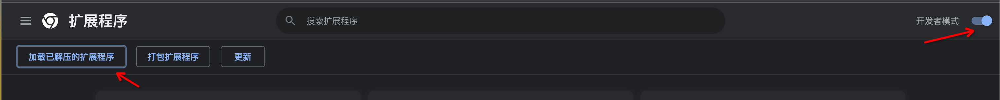

# macaca-recorder 浏览器插件

---

[![CI][ci-image]][ci-url]

[ci-image]: https://github.com/macacajs/macaca-recorder/actions/workflows/ci.yml/badge.svg
[ci-url]: https://github.com/macacajs/macaca-recorder/actions/workflows/ci.yml

## 插件说明

- 支持鼠标移动到指定元素获取对应的 xpath 信息
- 支持记录鼠标点击、双击、输入、鼠标悬浮等操作步骤
- 支持 macaca、cypress 等代码模版

<p align="left">
  
</p>

## 如何开发

```bash
# 安装 npm 依赖
$ npm install

# 本地打包
$ npm run build
```

## 安装使用

1. 浏览器输入：`chrome://extensions/` 
2. 加载 build 后的产物 dist/* 文件夹

<p align="left">
  
</p>

3. 插件常驻

<p align="left">
  
</p>

4. 将插件钉在浏览器右上角（点击插件可开启/关闭插件）
5. 刷新页面，右下角可看到插件图标
6. 鼠标移动到元素时，插件会实时展示当前元素 xpaht，点击、双击等操作会默认选择第一个 xpath，如需选择其它 xpath， 可通过`Option+Space (MacOS) / Alt+Space(Windows)` 开启、关闭鼠标移动监听，选择其它 xpath 后，点击对应的操作即可
7. 如鼠标无法选择对应元素，可打开元素调试面板，选中对应的元素，即可获取该元素的 xpath

<!-- GITCONTRIBUTOR_START -->

## 贡献者

|[<br/><sub><b>ilimei</b></sub>](https://github.com/ilimei)<br/>|[<br/><sub><b>xudafeng</b></sub>](https://github.com/xudafeng)<br/>|[<br/><sub><b>snapre</b></sub>](https://github.com/snapre)<br/>|[<br/><sub><b>yihuineng</b></sub>](https://github.com/yihuineng)<br/>|[<br/><sub><b>Jodeee</b></sub>](https://github.com/Jodeee)<br/>|
| :---: | :---: | :---: | :---: | :---: |


[git-contributor 说明](https://github.com/xudafeng/git-contributor)，自动生成时间：`Wed Aug 30 2023 15:12:58 GMT+0800`。

<!-- GITCONTRIBUTOR_END -->
